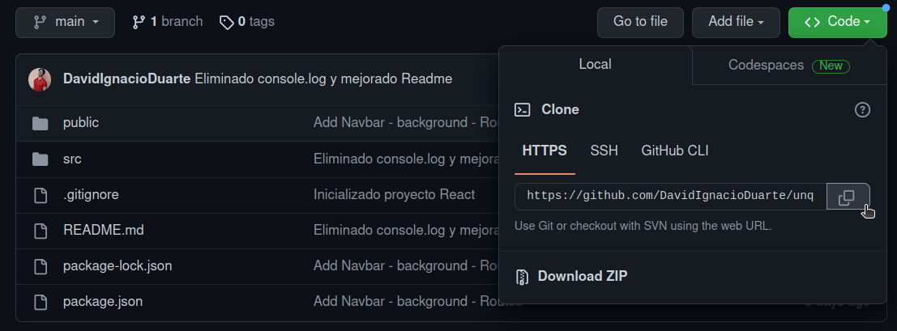
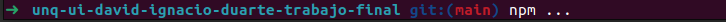
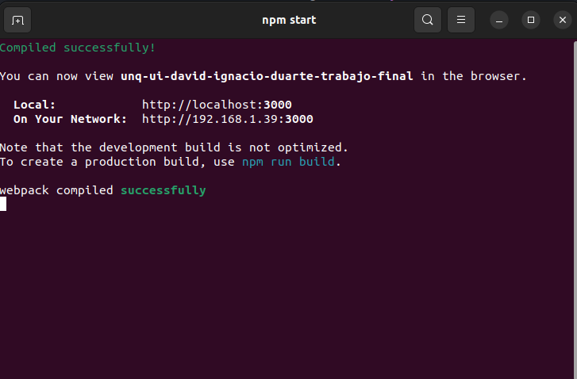
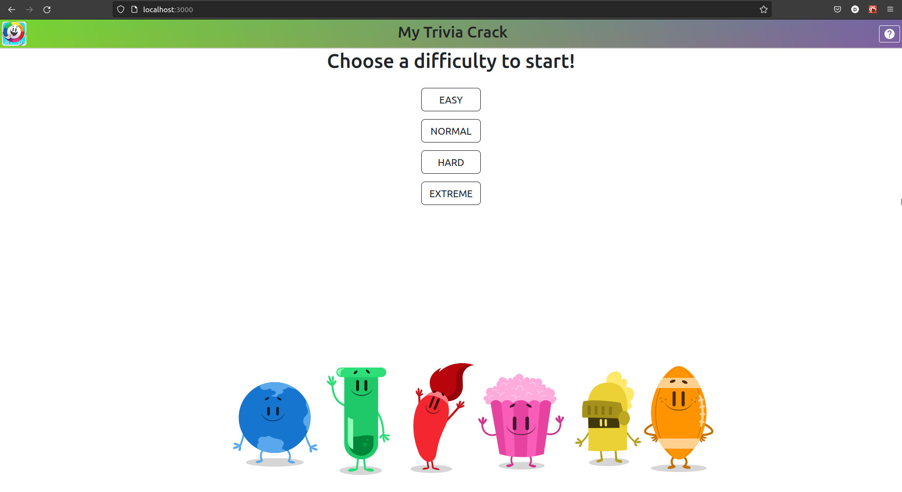

# My Trivia Crack

A quick trivia game for play while you drink ☕ or 🧉

## Requirements

* NodeJs installed, version **12** or higher (*if you have Node installed, you can check your version with CLI command `node -v`*)

* Any browser

* Desire to have fun!

## How to play

We should to run locally this project, following the next steps:

1. **Clone** or **download** this repository



2. Located at the beginning of the local repository, run next commands in CLI in order:

```
npm install
npm start
```



3. Open the link of `localhost` showed in terminal with any browser.



4. Enjoy!

